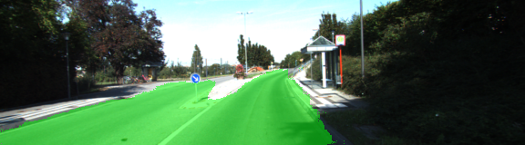
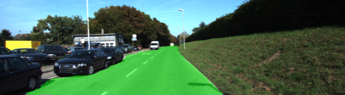
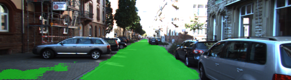
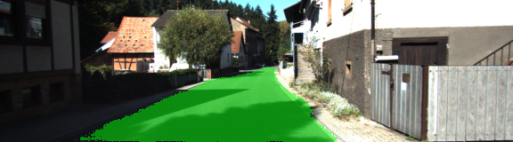
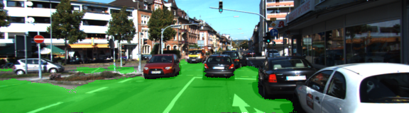

# Semantic Segmentation
### Introduction
Label the pixels of road using Fully Conventional Network. 
The basic idea is presented in https://people.eecs.berkeley.edu/~jonlong/long_shelhamer_fcn.pdf. My summary of understanding is as follows. 
  - Take a image classifier network architecture (in this case VGG16) and change it in a way that spatial dimensions are preserverd. This is done by 
  - Changing fully connected layers to 1x1 convolutions. HxW is preserved
  - Using transposed convolutions to 'decode' or upsample H and W
  - Use skip connections to preserve spatial information (which should also overcome vanishing and explodig gradient)

### Code
There are 5 main functions. 
1. load_vgg() : Loads the vgg network and extracts 5 layers, 3 of which we will need to build our subsequent layers on.
   * These layers are layer3, layer4 and layer4
2. layers(): Takes the 3 layers and number of output classes (always 2 in our case. Road/No-road) and builds the network
   * Take layer 7 and use 1x1 convolution to reduce number of filters from previous layer to what we need for our 2 classes.
   * Upsample this by factor of 2 using transpose convolution
   * Create a skip connection from layer 4 to upsampled output ( after similarly reducing its number of filters to 2)
   * Upsample again by factor of 2
   * Create a skip connection from layer 3
   * Finally upsample again by factor of 8
3. optimize() : Create an optimizer for loss function. Loss function is defined using soft max cross entropy. For optimizer   standard Adam optimizer is used.
4. train_nn: Train the network over given batches and epochs.
5. run(): This function finally sets up every thing by calling above 4 functions, trains the network and saves samples of inference in run/ directory

### Results
1. The results are pretty impressive in that almost all of the road pixels are classified as such. However it does seem that it does wrongly classifies many pixels also. Below are few examples.

* Things work out pretty well. But some area of footpath is wrongly classified

* Cars are neatly avoided.

* Again footpath is wrongly classified.

* Works well in shadows and in light.

* Complex area is handled well.
